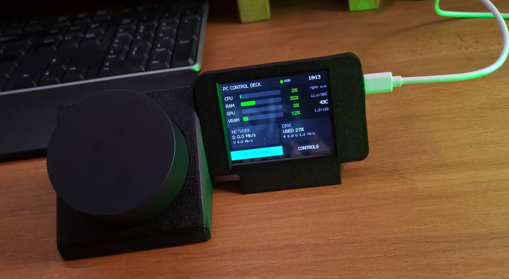

# ESP32 PC Control Deck

A USB-connected ESP32 desktop display that monitors a Windows, macOS or Linux computer and works as a small touch control panel.

The project turns the Elecrow 2.8-inch ESP32 Solo Miner LCD Display into a practical desk device. One USB cable powers the ESP32, sends live telemetry from the PC to the screen, and sends touch-button events back to the computer. No Wi-Fi or Bluetooth is required.

Repository: https://github.com/lepczynski-cloud/ESP32-PC-Control-Deck



## Demo

YouTube video: https://www.youtube.com/watch?v=16eqHU4j9Fk


## Features

### PC monitor

- CPU usage
- RAM usage and used/total memory
- GPU usage
- VRAM usage and used/total memory
- GPU temperature through `nvidia-smi`
- optional CPU, system and storage temperatures through LibreHardwareMonitor on Windows
- network download and upload speed
- disk usage and read/write activity
- PC clock synchronized from the host bridge
- USB status and stale-data indicator

### Touch controls

The default control page contains six buttons:

| Button | Default action |
| --- | --- |
| ChatGPT | Open `https://chatgpt.com/` |
| Ollama | Check local Ollama and start it when needed |
| Voice Server | Start a local voice-server script after you set its path |
| Terminal | Open the platform terminal |
| Task Manager | Open the platform system monitor |
| Lock PC | Lock or sleep the current session |

All labels and actions are configured in `host/config.json`. The example configuration is safe to publish and uses placeholder paths for local scripts.

## How it works

```text
PC
- reads CPU, RAM, GPU, network and disk data
- optionally reads sensors from LibreHardwareMonitor
- sends telemetry over USB serial
- executes trusted local actions from config.json

USB serial through CH340

ESP32 display
- shows live PC statistics
- shows six touch buttons
- sends only a numeric macro ID back to the PC
```

The board uses a classic ESP32-WROOM-32 and a CH340 USB-to-UART bridge. It does not expose native USB HID keyboard support through the USB-C port. Keyboard-like actions are handled by the local host bridge after the ESP32 sends a macro ID.

## Target hardware

This project was created for this device:

```text
Elecrow 2 PACK 2.8inch ESP32 Solo Miner LCD Display Cryptocurrency Solo Miner with 1000KH/s Hashrate
```

Product page:

```text
https://www.elecrow.com/2-8inch-esp32-miner-lcd-display-2pcs-cryptocurrency-solo-miner-with-1000kh-s-hashrate.html
```

Tested hardware summary:

- 2.8-inch ESP32 miner-style LCD display
- ESP32-WROOM-32-N4 module
- 320x240 ILI9341V TFT
- XPT2046 resistive touch controller
- CH340 USB serial bridge

The pinout matches the hardware used in the CrowPanel Pocket Arcade project:

```text
https://github.com/lepczynski-cloud/crowpanel-pocket-arcade
```

See `docs/HARDWARE.md` for pinout details.

## Repository layout

```text
README.md
CHANGELOG.md
LICENSE
SECURITY.md
platformio.ini
src/main.cpp
host/config.example.json
host/control_deck_bridge.py
host/run_windows.bat
host/run_linux_macos.sh
host/install_autostart_windows.ps1
host/uninstall_autostart_windows.ps1
host/tests/test_bridge.py
docs/HARDWARE.md
docs/LINUX_MACOS.md
docs/MACROS.md
docs/PROTOCOL.md
docs/TEMPERATURES.md
docs/PUBLISHING.md
docs/media/ESP32_PC_Control_Deck.jpg
docs/media/control-deck-demo.gif
docs/media/README.md
```

## Quick start

### 1. Flash the firmware

Open the repository in CLion with PlatformIO and run:

```bash
pio run -e esp32_pc_control_deck
pio run -t upload -e esp32_pc_control_deck
```

On first boot, follow the touch calibration on the display. The calibration is saved in ESP32 preferences.

The same firmware and serial protocol are used on all supported operating systems. If the display already works on Windows with firmware 0.3.3, it does not need to be flashed again for host bridge 0.4.0.

### 2A. Start the host bridge on Windows

Run:

```text
host\run_windows.bat
```

On the first run, the script creates a virtual environment, installs Python dependencies, copies `config.example.json` to `config.json`, and starts the bridge.

If several CH340 serial devices are connected, set the port manually in `host/config.json`:

```json
{
  "serial_port": "COM7"
}
```

The Windows launcher and Windows actions are unchanged in version 0.4.0.

### 2B. Start the host bridge on macOS or Linux

Run these commands from the extracted repository directory:

```bash
chmod +x host/run_linux_macos.sh
./host/run_linux_macos.sh
```

You can also run the shell script without changing its executable bit:

```bash
sh host/run_linux_macos.sh
```

Do not run the `.sh` file through Python. `run_linux_macos.sh` is a shell script, not a Python program.

On the first run, the launcher checks Python, creates `host/.venv`, installs the dependencies, creates `host/config.json` and starts the bridge. Later runs reuse the same environment.

To inspect the detected USB serial ports without starting the bridge:

```bash
./host/run_linux_macos.sh --list-ports
```

If automatic detection does not select the board, set the port manually in `host/config.json`:

```json
{
  "serial_port": "/dev/cu.wchusbserial1420"
}
```

Typical values are `/dev/cu.wchusbserial*` or `/dev/cu.usbserial*` on macOS and `/dev/ttyUSB0` on Linux. See `docs/LINUX_MACOS.md` for permissions, diagnostics and platform limitations.

## Configure the voice-server button

The public example does not include a private local path. Edit your local ignored file:

```text
host/config.json
```

Change the Voice Server command and working directory to your real local script path.

Example for Windows:

```json
{
  "id": 3,
  "label": "Voice Server",
  "action": "command",
  "new_console": true,
  "value": {
    "windows": ["cmd.exe", "/c", "C:\\Path\\To\\START_VOICE_SERVER.cmd"]
  },
  "working_directory": {
    "windows": "C:\\Path\\To"
  }
}
```

Do not commit your local `host/config.json` if it contains private paths or secrets. It is ignored by default.

## Ollama button

The Ollama button checks:

```text
http://127.0.0.1:11434/api/tags
```

If Ollama already responds, the bridge does not start a duplicate process. If it is not running, it starts:

```text
ollama serve
```

## Temperatures

Windows usually does not expose CPU temperature through `psutil`. For more sensors, run LibreHardwareMonitor and enable:

```text
Options -> Remote Web Server -> Run
```

The bridge reads:

```text
http://127.0.0.1:8085/data.json
```

To list detected temperature sensors:

```text
host\.venv\Scripts\python.exe host\control_deck_bridge.py --list-temperatures --config host\config.json
```

If no CPU temperature is available, the display uses a clear fallback:

- CPU row: `TEMP N/A` or `SYS xxC`
- RAM row: used/total memory
- GPU row: GPU temperature or `TEMP N/A`
- VRAM row: used/total memory
- Disk box: read/write activity and optional disk temperature

LibreHardwareMonitor is enabled by default only on Windows. Linux uses temperatures exposed by `psutil` when the operating system provides them. macOS usually reports CPU temperature as unavailable without an additional privileged sensor tool, which this project does not require.

## Start automatically with Windows

Run `host/run_windows.bat` once, then execute from the repository root:

```powershell
powershell -ExecutionPolicy Bypass -File .\host\install_autostart_windows.ps1
```

Remove the startup shortcut with:

```powershell
powershell -ExecutionPolicy Bypass -File .\host\uninstall_autostart_windows.ps1
```

## Serial protocol

The protocol uses newline-delimited JSON frames prefixed with `DD:`.

Example:

```text
DD:{"type":"stats","cpu":18.2,"ram":61.7}
```

The prefix prevents ESP32 boot messages from being parsed as application JSON. See `docs/PROTOCOL.md` for details.

## Security notes

- The ESP32 stores no passwords, browser cookies, API keys or account credentials.
- The ESP32 sends only a macro ID from 1 to 6.
- The host bridge executes only actions configured locally in `host/config.json`.
- Keep `host/config.json` out of Git if it contains local paths or private commands.

See `SECURITY.md` for more details.

## License

MIT. See `LICENSE`.
